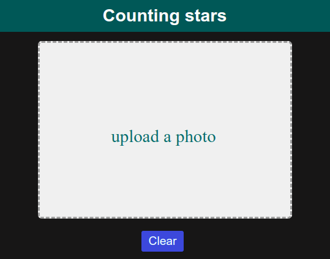
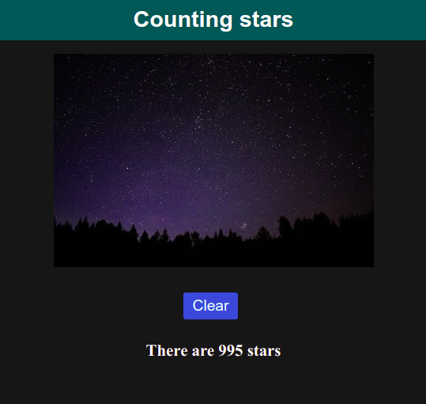

# Counting stars

A simple web app for counting stars ⭐⭐⭐

### Technologies used:
- CSS3
- JavaScript
- HTML5
- [Marvin JS](https://github.com/gabrielarchanjo/marvinj) (image manipulation)

### Basis algorithm (counting bright groups of pixels)
1. Resize input image.
2. Umbralize image using three different thresholds.
3. For each umbralized image:
    - Count groups of white pixels using DFS (Depth-First Search).
4. Sum counts and calculate the average.

### Usage

**Upload a starry nigth photo**

**You can see the result, click at _Limpiar_ to try with another photo**

### Notes:
- If you want to contribute feel free to create a Pull Request.
